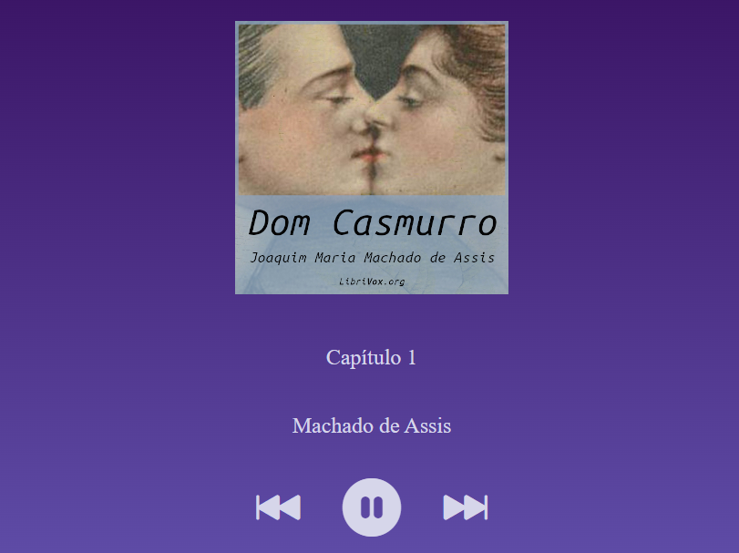

<h1 align="center">Audiobook</h1>

Projeto de audiobook, da aula 1 do intensivão JavaScript disponibilizado pela Hashtag 

  <a href="#-tecnologias">Tecnologias</a>&nbsp;&nbsp;&nbsp;|&nbsp;&nbsp;&nbsp;
  <a href="#-projeto">Projeto</a>&nbsp;&nbsp;&nbsp;|&nbsp;&nbsp;&nbsp;
  <a href="#memo-licença">Licença</a>

  

 

## Tecnologias

Este projeto foi desenvolvido com as seguintes tecnologias:

_ HTML e CSS
_ Javascript
_ Git e Github

## Projeto

Audiobook Dom Casmurro de Machado de Assis, com botões funcionais.

## :memo: Licença

Este projeto está sob a Licença MIT.
